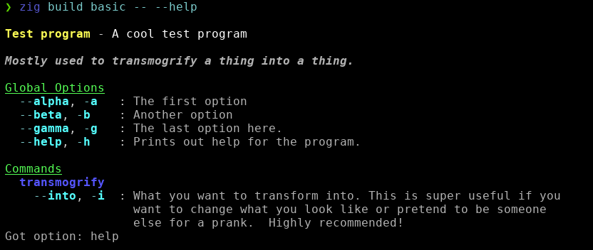

# Overview


Zargunaught is an argument parsing library for zig, based off of my earlier `argunaught` C++ library.  It features a simple API for configuring global options, commands and command specific options.

It doesn't try to map your options into a structure or use meta programming tricks to determine the types of option values.  It instead parses them into a results structure and provides helpers for getting them, leaving the semantic meaning up to the client program.

# Features

- Global options, with long and short names.
- Min/max number of parameters and positional arguments.
- Support for commands with extended options per command.
- Options stacking, like `-vvv` to mark `v` as having occurred 3 times, with options for max allowed (or no stacking).
- Default values for options as either set to true, single parameter or multiple parameters.
- Ability to prepend `no-` to unset a default enabled option.
- Help text formatter with word-wrapping and basic color theming support.
- Grouping of commands for better formatted help text.
- `--` to stop option parsing and consider the rest of the command line as positional arugments.

# installing

the easiest way to use `zargunaught` in your zig program is to grab the latest tag:

```
zig fetch https://github.com/srjilarious/zargunaught/archive/refs/tags/v0.5.0.tar.gz
```

and then add it as a dependency in your `build.zig`:

```
const zargsmod = b.dependency("zargunaught", .{});
exe.root_module.addimport("zargunaught", zargsmod.module("zargunaught"));
```

# example

a simple configuration and parsing example can be seen in the `examples/basic.zig` program

here's what the help output looks like for the basic example below:



and here's the setup code in the example:

```zig
var parser = try zargs.argparser.init(
    std.heap.page_allocator, .{ 
        .name = "test program",
        .description = "a cool test program",
        .usage = "mostly used to transmogrify a thing into a thing.",
        .opts = &[_]option{
            option{ .longname = "alpha", .shortname = "a", .description = "the first option", .maxnumparams = 0 },
            option{ .longname = "beta", .shortname = "b", .description = "another option", .maxnumparams = 1 },
            option{ .longname = "gamma", .shortname = "g", .description = "the last option here.", .maxnumparams = -1 },
        },
        .commands = &.{
        .{ .name = "help", .description = "prints out this help." },
        .{ .name = "transmogrify", 
           .opts = &.{
                .{ .longname = "into", .shortname = "i", .description = "what you want to transform into. this is super useful if you want to change what you look like or pretend to be someone else for a prank.  highly recommended!", .maxnumparams = 1 }
            }
        }
    }
    });
defer parser.deinit();

var args = parser.parse() catch |err| {
    std.debug.print("error parsing args: {any}\n", .{err});
    return;
};
defer args.deinit();
```

here you can see global options being setup, along with commands where one has a command specific option available.


# Feature Usage

## Help text
There is a built in help formatting module that can format the information in the argument parser configuration nicely and which is easy to style with different colors and such.

it also handles wrapping lines of descriptions for options and commands that get too long and properly indenting them to be more pleasing.

to display the help text, you could use the following code:

```zig
if(args.hasoption("help")) {
    var help = try zargs.help.HelpFormatter.init(&parser, stdout, zargs.help.DefaultTheme, std.heap.page_allocator);
    defer help.deinit();

    help.printHelpText() catch |err| {
        std.debug.print("Err: {any}\n", .{err});
    };
}
```

## Min/Max Parameters and Positional Arguments

By default there are no minimum or maximum number of parameters for each option, which means a user is able to provide as many, or no parameters to an option.  If you want the parser to throw an error depending on the number of parameters to an option:

```zig
var parser = try zargs.ArgParser.init(std.heap.page_allocator, .{ .name = "Simple options", .opts = &.{
    .{ .longName = "delta", .shortName = "d", .description = "", .minNumParams = 1, .maxNumParams = 3 },
} });
```

This would force the delta option to be provided with one to three parameters by the user.

You can similarly configure the parser to expect a minimum and/or maximum number of positional arguments

```zig
var parser = try zargs.ArgParser.init(std.heap.page_allocator, .{
    .name = "Simple options",
    .minNumPositionalArgs = 1,
    .maxNumPositionalArgs = 2,
});
```

## Default Values

The following shows the three options for default values

```zig
var parser = try zargs.ArgParser.init(std.heap.page_allocator, .{ .name = "Default options", .opts = &.{
  .{ .longName = "beta", .shortName = "b", .description = "", .default = zargs.DefaultValue.set() },
  .{ .longName = "gamma", .shortName = "g", .description = "", .default = zargs.DefaultValue.param("blah") },
  .{ .longName = "delta", .shortName = "d", .description = "", .default = zargs.DefaultValue.params(&.{ "boop", "blop", "bleep" }) },
} });
```

Here `beta` will be set, but no have any parameters associated with it.  A user could use `--no-beta` to unset it during argument parsing.

The `gamma` option will by default be set with a single `blah` parameter, and `delta` will be set with the three values `boop`, `blop` and `bleep`.


## Option Stacking

Options are allowed to be set multiple times, where each time adds any new parameters to the list or parameters already seen.  For example, an `input` option could be given as `--input one --input two --input three` and the result will show a single `input` `OptionResult` with three parameters.

Each time an option is seen, the `numOccurences` attribute of `OptionResult` is incremented.  You can limit the number of occurences with the `maxOccurences` attribute when defining an option:

```zig
var parser = try zargs.ArgParser.init(std.heap.page_allocator, .{ .name = "Simple options", .opts = &.{
        .{ .longName = "verbose", .shortName = "v", .description = "log verbosity", .maxOccurences = 5 },
        .{ .longName = "delta", .shortName = "d", .description = "" },
    } });
```

## Command Groups

Command groups are useful for gathering a number of related commands together when printing out the help text.  they can be defined in the `ArgParser` initial configuration by providing a list of `CommandGroup` structs, that are simply a `name` and an array of `Commands`:

```zig
var parser = try zargs.ArgParser.init(std.heap.page_allocator, .{ 
    .name = "Simple command configuration", 
    .opts = &.{
        .{ .longName = "beta", .shortName = "b", .description = "", .maxNumParams = 1 },
        .{ .longName = "delta", .shortName = "d", .description = "", .maxNumParams = 1 },
    },
    .commands = &.{
        .{ .name = "test" },
        .{ .name = "transmogrify", .group = "experimental",
            .opts = &.{
                .{ .longName = "into", .shortName = "i", .description = "", .maxNumParams = 1 }
            }
        }
    },
    .groups = &.{
        .{
            .name = "evocation",
            .commands = &.{ 
                .{ .name = "fire" },
                .{ .name = "ice" },
                .{ .name = "thunder" }
            }
        }
    }
});
```
